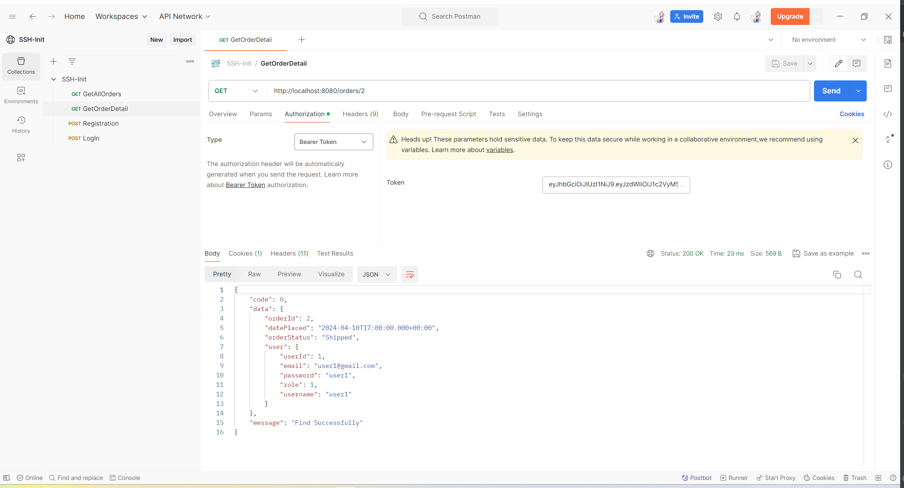
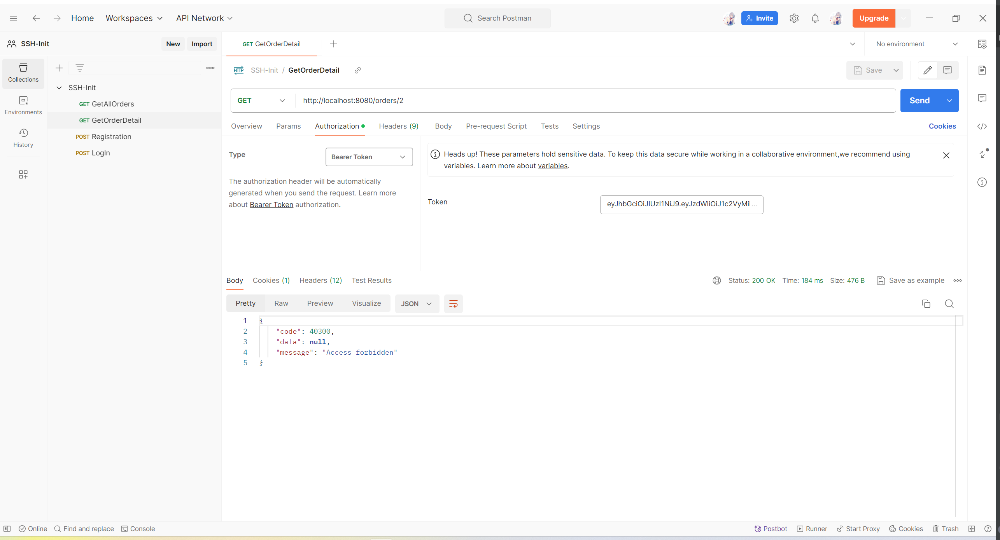

# SSH-Init

- A Template for Springboot + SpringSecurity + Hibernate Project

## Environment

- Java 1.8
- Spring Boot 2.7.14
- Spring Security 2.7.14
- Hibernate 5.6.15
- MySQL 8

## Features

- UserController
  - User Register: prevent registration using the same username and email
  - User Login
- Authentication
  - [JwtProvider.java](src%2Fmain%2Fjava%2Fcom%2Fexample%2FSSH_Init%2Fsecurity%2FJwtProvider.java): JWT create and
    resolve
  - [JwtFilter.java](src%2Fmain%2Fjava%2Fcom%2Fexample%2FSSH_Init%2Fsecurity%2FJwtFilter.java): Filter all incoming
    requests and set Authentication Object in SecurityContextHolder if the credential is valid
- Authorization:
  - `@PreAuthorize("hasAuthority('read')")`
- Dao
  - [AbstractHibernateDao](src%2Fmain%2Fjava%2Fcom%2Fexample%2FSSH_Init%2Fdao%2FAbstractHibernateDao.java): Common
    Abstract Dao
- Service
  - [AbstractHibernateService](src%2Fmain%2Fjava%2Fcom%2Fexample%2FSSH_Init%2Fservice%2FAbstractHibernateService.java):
    Common Abstract Service
- Exception
  - [BusinessException.java](src%2Fmain%2Fjava%2Fcom%2Fexample%2FSSH_Init%2Fexception%2FBusinessException.java):
    Customized BusinessException extending from RuntimeException
  - [Global Exception Handler](src%2Fmain%2Fjava%2Fcom%2Fexample%2FSSH_Init%2Fexception%2FMyExceptionHandler.java)
- Response
  - [BaseResponse.java](src%2Fmain%2Fjava%2Fcom%2Fexample%2FSSH_Init%2Fdto%2FBaseResponse.java): Unified response
    structure
  - [ErrorCode.java](src%2Fmain%2Fjava%2Fcom%2Fexample%2FSSH_Init%2Fdto%2FErrorCode.java): Customized Error Code
- Validation
  - `@Valid` on request parameter + `@NotBlank` on corresponding dto fields

## Notes

- Use @JsonIgnore to avoid error: Could not write JSON: failed to lazily initialize a collection of role

## Screenshots

